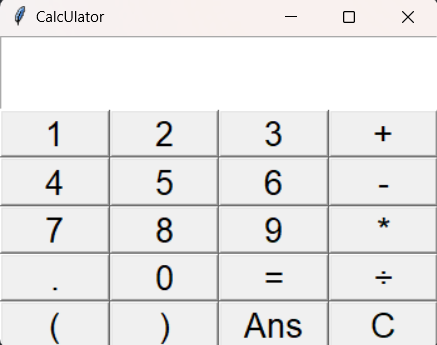

# CalcUlator

This is a simple command-line calculator program written in Python. It allows you to perform basic arithmetic operations such as addition, subtraction, multiplication, and division.

    

## Getting Started
### Prerequisites

You'll need to have Python installed on your computer to run this calculator. You can download Python from the official website: [Python.org](https://www.python.org/downloads/)

### Installation

1. Clone the repository to your local machine or download the ZIP file and extract it.
